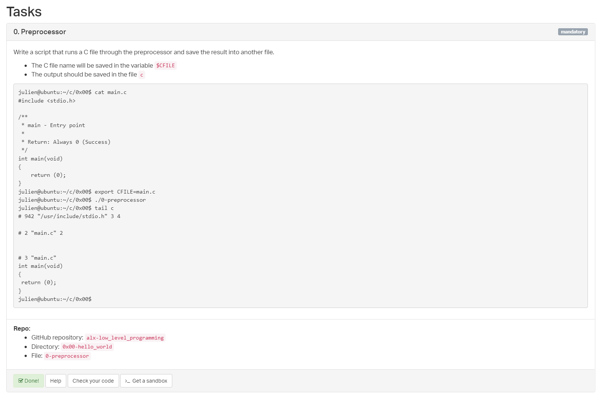
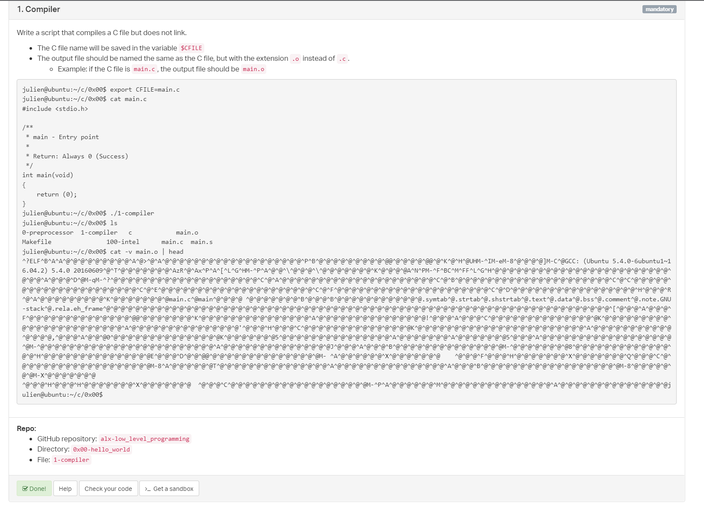
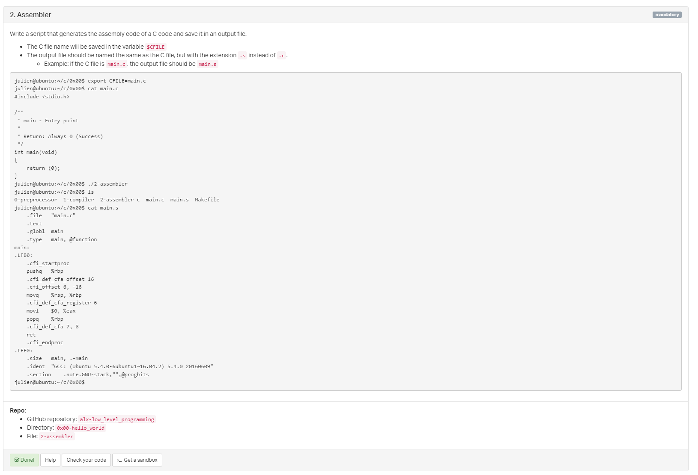
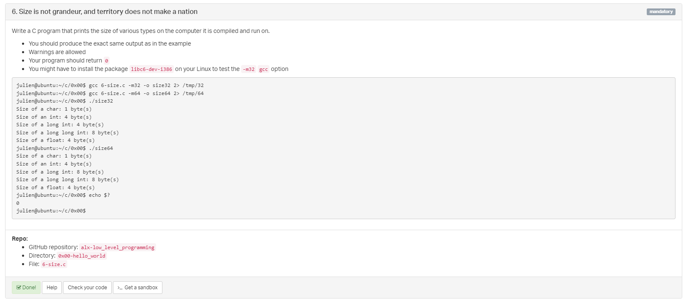
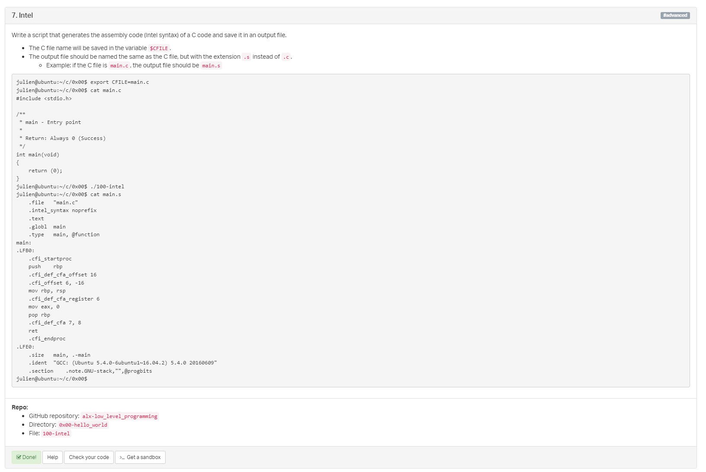
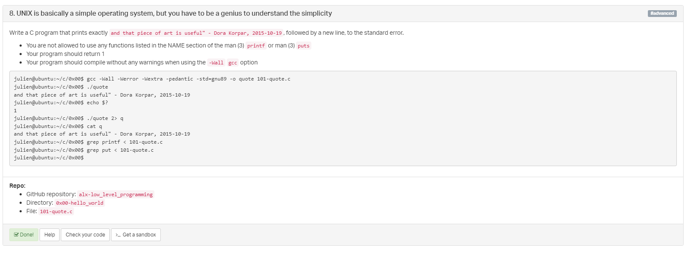

# 0x00-hello_world

# Creating an enviroment variable ```$CFILE``` for testing

`Create a file main.c that follows the betty linter formatting in the working directory an example is given below`

```c
#include <stdio.h>

/**
 * main - Entry point
 *
 * Return: Always 0 (Success)
 */
int main(void)
{
	return (0);
}
```

`export the file name to an enviroment variable as shown below`

```bash
export CFILE=main.c
```

# Task 0


```bash
#!/bin/bash
gcc -E $CFILE -o c
```
# Task 1


```bash
#!/bin/bash
gcc -c $CFILE
```

# Task 2


```bash
#!/bin/bash
gcc -S $CFILE
```

# Task 3


```bash
#!/bin/bash
gcc $CFILE -o cisfun
```

# Task 4


```c
#include <stdio.h>

/**
 * main - Entry point
 *
 * Return: Always 0 (Success)
 */
int main(void)
{
	puts("\"Programming is like building a multilingual puzzle");
	return (0);
}
```

# Task 5


```c
#include <stdio.h>

/**
 * main - Entry point
 *
 * Return: Always 0 (Success)
 */
int main(void)
{
	printf("with proper grammar, but the outcome is a piece of art,\n");
	return (0);
}
```

# Task 6


```c
#include <stdio.h>

/**
 * main - Entry point
 *
 * Return: Always 0 (Success)
 */
int main(void)
{
	printf("Size of a char: %ld byte(s)\n", sizeof(char));
	printf("Size of an int: %ld byte(s)\n", sizeof(int));
	printf("Size of a long int: %ld byte(s)\n", sizeof(long int));
	printf("Size of a long long int: %ld byte(s)\n", sizeof(long long int));
	printf("Size of a float: %ld byte(s)\n", sizeof(float));
	return (0);
}
```

# Task 7


```bash
#!/bin/bash
gcc -S -masm=intel $CFILE
```

# Task 8


```c
#include <stdio.h>
#include <string.h>

/**
 * main - Entry point
 *
 * Return: Always 0 (Success)
 */
int main(void)
{
	char *str = "and that piece of art is useful\" - Dora Korpar, 2015-10-19\n";
	size_t len = strlen(str);
	/* Starting main */
	fwrite(str, len, 1, stderr);
	return (1);
}
```


